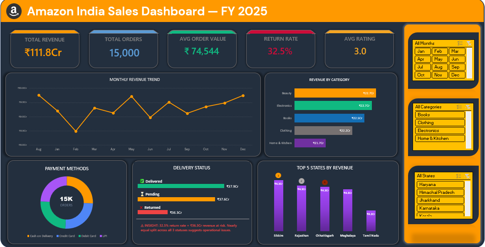

# Amazon India Sales Dashboard — FY 2025

> Analyzing 15,000 Amazon India orders to uncover revenue trends, delivery performance, and customer behavior across FY 2025.

---

## 1. Project Background

E-commerce in India has grown into one of the largest and fastest-moving retail markets in the world. Amazon India, as a key player, processes millions of orders annually across diverse product categories and states.

This project analyzes a full fiscal year of Amazon India sales data — 15,000 orders across 5 product categories and 28+ states — to identify where revenue is being generated, where it is being lost, and what operational patterns are driving customer satisfaction or dissatisfaction.

As a fresher data analyst, I chose this dataset because it covers the full sales funnel — from order placement to delivery and review — giving a complete picture of business performance that goes beyond simple revenue tracking.

---

## 2. Data Structure & Initial Checks

**File:** `Amazon_salesdata_analysis_2025.xlsx`
**Rows:** 15,000 | **Columns:** 15
**Each row:** One customer order

---

<b>Column Reference</b>

 

| Column | Data Type | Description |
|--------|-----------|-------------|
| `Order_ID` | Text | Unique order identifier |
| `Date` | Date | Order date (FY 2025) |
| `Customer_ID` | Text | Unique customer identifier |
| `Product_Category` | Text | Category (Beauty, Electronics, Books, Clothing, Home & Kitchen) |
| `Product_Name` | Text | Name of the product ordered |
| `Quantity` | Integer | Number of units ordered |
| `Unit_Price_INR` | Decimal | Price per unit in Indian Rupees |
| `Total_Sales_INR` | Decimal | Total order value in INR |
| `Sales_Cr` | Decimal | Order value converted to Crores |
| `Payment_Method` | Text | Cash on Delivery / Credit Card / Debit Card / UPI |
| `Delivery_Status` | Text | Delivered / Pending / Returned |
| `Review_Rating` | Integer | Customer rating (1–5) |
| `Review_Text` | Text | Written customer feedback |
| `State` | Text | Indian state where order was placed |
| `Country` | Text | Country (India) |

---

<b>Initial Checks Performed</b>

 

- Imported raw data into Power Query and checked for null values in all key columns
- Verified `Date` column was correctly parsed — no mixed formats
- Confirmed `Delivery_Status` had exactly 3 distinct values: Delivered, Pending, Returned
- Confirmed `Product_Category` had exactly 5 distinct values with no spelling inconsistencies
- Converted `Total_Sales_INR` to `Sales_Cr` column for dashboard-friendly display
- Created 6 structured report sheets from raw data using XLOOKUP, COUNTIF, SUMIF, and AVERAGEIF
- Built Pivot Tables for monthly trends, state revenue, delivery breakdown, and payment methods
- Applied Conditional Formatting on KPI cells and report tables for visual clarity
- Loaded data into Power Pivot to create a data model for the dashboard

---

<b>Workbook Structure</b>

 

| Sheet | Purpose |
|-------|---------|
| `salesdata` | Raw data — 15,000 rows, 15 columns |
| `RPT_LOOKUP` | Report 1 — Customer order lookup by Order ID |
| `RPT_CATEGORY` | Report 2 — Category performance summary |
| `RPT_STATE` | Report 3 — State revenue lookup |
| `RPT_RATING` | Report 4 — Rating analysis report |
| `RPT_DELIVERY` | Report 5 — Delivery performance report |
| `RPT_PAYMENT` | Report 6 — Payment method analysis |
| `PT1_Monthly` | Pivot — Monthly revenue trend |
| `PT2_State` | Pivot — Top states by revenue |
| `PT3_Delivery` | Pivot — Delivery status breakdown |
| `PT4_Payment` | Pivot — Payment method breakdown |
| `KPI` | Calculated KPI values feeding the dashboard |
| `Dashboard` | Final interactive dashboard |

---

## 3. Problem Statement

Amazon India processes a high volume of orders daily, but raw transaction data alone does not reveal where the business is performing well and where it is losing revenue. A 32.5% return rate, uneven delivery performance, and a low average rating of 3.0 out of 5 suggest there are significant operational and customer experience issues that need to be identified and addressed.

This dashboard was built to answer:

- Which product categories are driving the most and least revenue?
- Why is the return rate at 32.5% and which segment is most at risk?
- Which states are contributing most to revenue and which are underperforming?
- Is there a relationship between payment method and order volume?
- What is driving the low average customer rating of 3.0?

---

## 4. Key Insights

| # | Insight | Finding |
|---|---------|---------|
| 1 | **Revenue is evenly spread across categories** | Beauty leads at ₹22.7Cr but all 5 categories are within ₹1Cr of each other |
| 2 | **Return rate is critically high** | 32.5% return rate = ₹36.3Cr revenue at risk — nearly equal to Delivered revenue of ₹37.9Cr |
| 3 | **Delivery performance is nearly split three ways** | Delivered, Pending, and Returned are each close to ₹37Cr — a highly abnormal distribution |
| 4 | **Sikkim leads all states despite its small size** | Top state by revenue at ₹4.3Cr, which is disproportionate to its population |
| 5 | **Average rating of 3.0 signals widespread dissatisfaction** | A midpoint rating across 15,000 orders suggests systemic product or delivery issues |
| 6 | **Revenue trend is inconsistent month to month** | Monthly revenue fluctuates significantly with no clear seasonal growth pattern |

---

## 5. Insight Deep Dive

> Click each insight to expand the full analysis

---

<b>Insight 1 — Revenue is Evenly Spread Across All 5 Categories</b>

 

**Chart: Revenue by Category (Horizontal Bar Chart)**

| Category | Revenue |
|----------|---------|
| Beauty | ₹22.7Cr |
| Electronics | ₹22.7Cr |
| Books | ₹22.5Cr |
| Clothing | ₹22.2Cr |
| Home & Kitchen | ₹21.7Cr |

All five categories fall within a narrow ₹1Cr band of each other. This uniformity is unusual — in most e-commerce businesses, one or two categories dominate revenue while others trail significantly.

This could indicate the dataset is balanced by design, or it could reflect Amazon India's broad appeal across categories without a dominant bestseller segment.

> **Key Takeaway:** No single category is carrying the business — and no category is clearly underperforming. Any improvement in return rates or ratings would lift all categories fairly equally.

---

<b>Insight 2 — A 32.5% Return Rate Puts ₹36.3Cr of Revenue at Risk</b>

 

**Chart: Delivery Status Breakdown (Bar Chart)**

| Delivery Status | Revenue |
|----------------|---------|
| Delivered | ₹37.9Cr |
| Pending | ₹37.6Cr |
| Returned | ₹36.3Cr |

The return rate of 32.5% is far above the industry benchmark for e-commerce (typically 10–15%). With ₹36.3Cr in returned orders, nearly one third of all revenue generated is being reversed.

The dashboard displays a direct alert: *"32.5% return rate = ₹36.3Cr revenue at risk. Nearly equal split across all 3 statuses suggests operational issues."*

This three-way near-equal split between Delivered, Pending, and Returned is the clearest warning signal in the entire dashboard — it suggests a structural problem with product quality, delivery experience, or customer expectations.

> **Key Takeaway:** If the return rate were brought down to the 15% industry benchmark, Amazon India would recover approximately ₹18–20Cr in net revenue.

---

<b>Insight 3 — Delivery Is Not Completing Its Job</b>

 

**Chart: Delivery Status (Bar Chart)**

A healthy e-commerce operation typically sees 80–90% of orders marked as Delivered. In this dataset, only approximately 33% of orders by revenue are Delivered.

The Pending figure of ₹37.6Cr is particularly concerning — it means a large portion of orders are stuck in limbo, neither successfully delivered nor returned. This creates a negative customer experience loop: customers wait, do not receive their order, leave low ratings, and eventually return the item.

> **Key Takeaway:** Pending orders are a hidden revenue and satisfaction risk. Resolving the pending backlog could directly improve both the return rate and the average customer rating.

---

<b>Insight 4 — Sikkim Leads Revenue Despite Being a Small State</b>

 

**Chart: Top 5 States by Revenue (Column Chart)**

| Rank | State | Revenue |
|------|-------|---------|
| 1 | Sikkim | ₹4.3Cr |
| 2 | Rajasthan | ₹4.3Cr |
| 3 | Chhattisgarh | ₹6.3Cr |
| 4 | Meghalaya | ₹4.3Cr |
| 5 | Tamil Nadu | ₹4.2Cr |

Sikkim appearing as the top revenue state is unexpected given its population of under 700,000. This may reflect high average order values, a specific product category performing well in that region, or data characteristics worth investigating further.

> **Key Takeaway:** State-level revenue distribution does not follow population size — identifying which product categories are driving revenue in smaller states could reveal niche opportunities.

---

<b>Insight 5 — Average Rating of 3.0 Signals Systemic Dissatisfaction</b>

 

**KPI Card: Avg Rating — 3.0 / 5**

A 3.0 average rating across 15,000 orders is a midpoint score — it means for every satisfied customer leaving a 4 or 5 star rating, there is a dissatisfied customer leaving a 1 or 2 star rating.

The review texts in the raw data include responses like *"Waste of money"* alongside *"Excellent product!"* — confirming the polarized customer experience.

Given the high return rate and delivery issues identified in previous insights, the low rating is likely a direct consequence of poor delivery performance rather than product quality alone.

> **Key Takeaway:** Improving delivery reliability would be the single highest-impact action for improving the average rating — customers who receive their orders on time and in good condition are significantly more likely to leave positive reviews.

---

<b>Insight 6 — Monthly Revenue Shows No Clear Growth Trend</b>

 

**Chart: Monthly Revenue Trend (Line Chart)**

The monthly revenue line chart shows a volatile pattern — revenue dips sharply in February and recovers unevenly across the year. There is no clear upward growth trajectory across FY 2025.

December shows the highest revenue, likely driven by end-of-year festive sales (Christmas and New Year), but the improvement is not sustained into a long-term trend.

> **Key Takeaway:** Without a consistent growth trend, the business is dependent on seasonal spikes rather than organic month-over-month growth. Stabilizing delivery performance and reducing returns would help flatten this volatility.

---

## 6. Recommendations

<b>Rec 1 — Urgently Investigate and Reduce the Return Rate</b>

 

The 32.5% return rate is the most critical issue in this dataset. It directly impacts revenue, operational costs, and customer satisfaction all at once.

**Steps to address it:**
- Segment returns by product category to identify which category has the highest return rate
- Cross-reference returns with review ratings to determine whether returns are driven by product quality or delivery damage
- Introduce stricter product listing standards for categories with the highest return rates
- Add clearer product descriptions and size guides to reduce expectation mismatch

---

<b>Rec 2 — Clear the Pending Order Backlog</b>

 

₹37.6Cr sitting in Pending status is a significant operational liability. Every pending order is a customer waiting for a resolution — and waiting customers leave low ratings and eventually initiate returns.

**Steps to address it:**
- Set a maximum pending duration threshold and auto-escalate orders past that threshold
- Prioritize high-value pending orders for manual follow-up
- Send proactive delivery updates to customers with pending orders to reduce cancellation requests

---

<b>Rec 3 — Investigate Why Low-Population States Are Leading Revenue</b>

 

Sikkim, Meghalaya, and Chhattisgarh appearing in the top 5 revenue states is worth a deeper investigation. Understanding what is driving outsized revenue in smaller states could reveal replicable strategies for other underperforming regions.

**Steps to address it:**
- Break down top state revenue by product category to identify what is being purchased
- Check average order value in top states vs bottom states — higher AOV may explain the rankings
- Consider targeted promotions in mid-tier states that have high population but are not in the top 5

---

<b>Rec 4 — Improve Average Rating Through Delivery, Not Just Product Quality</b>

 

The 3.0 average rating is being dragged down by delivery failures, not just product issues. Customers who experience late deliveries, damaged packaging, or return hassles are more likely to leave negative reviews regardless of product quality.

**Steps to address it:**
- Target a 4.0+ average rating by reducing returns and pending orders first
- Implement a post-delivery feedback prompt specifically asking about the delivery experience
- Use the Review_Text column to build a simple keyword analysis — identify the most common complaint words and prioritize those areas

---

## 7. Tools & Technologies

<b>View full tool breakdown</b>

 

| Tool | Purpose |
|------|---------|
| **Microsoft Excel** | Primary analysis environment — data storage, report sheets, dashboard |
| **Power Query** | Data import, cleaning, type correction, and transformation |
| **Power Pivot** | Data modeling and relationship building for KPI calculations |
| **Pivot Tables** | Monthly revenue, state breakdown, delivery and payment summaries |
| **XLOOKUP** | Customer order lookup report (RPT_LOOKUP) |
| **SUMIF / COUNTIF / AVERAGEIF** | Category, delivery, and payment report calculations |
| **Conditional Formatting** | Visual highlighting of KPIs, return rate alerts, and performance thresholds |
| **Excel Charts** | Line chart, bar charts, donut chart, column chart for the dashboard |
| **Slicers** | Interactive month, category, and state filters on the dashboard |

---

## 8. Dashboard

**KPI Cards:** Total Revenue · Total Orders · Avg Order Value · Return Rate · Avg Rating

**Charts:**
- Monthly Revenue Trend (Line Chart)
- Revenue by Category (Horizontal Bar)
- Payment Methods Distribution (Donut Chart)
- Delivery Status Breakdown (Bar Chart)
- Top 5 States by Revenue (Column Chart)

**Slicers:** Month · Category · State

---

### Dashboard Screenshot

---

## 9. Author & Contact

**Vishrutha Kotian**
Aspiring Data Analyst | Excel · Power BI · SQL · Python

| Platform | Link |
|----------|------|
| Email | kotianvishrutha@gmail.com |
| LinkedIn | [vishrutha-kotian-209754206](#) |
| GitHub | [github.com/Vishruthakotian](#) |